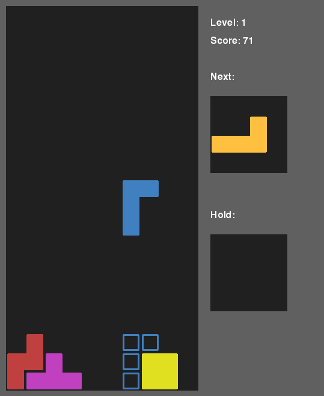

# Blokk

Blokk is a falling blocks game that is:
* Extendable: Developers can easily implement their own game mechanics and game modes
* Configurable: Players can set detailed settings regarding mechanics, rotation systems, controls and other things



<!-- toc -->

- [About Blokk](#about-blokk)
  - [Built With](#built-with)
- [Getting Started](#getting-started)

<!-- tocstop -->

## About Blokk

So far, the game features:
* Game modes for one and two players
* Sending garbage lines in two player mode
* Implementations for a few different block queues
* Keyboard and Gamepad support (no remapping possible yet)

### Built With

* [pygame](https://github.com/pygame/pygame)
* [numpy](https://github.com/numpy/numpy)

## Getting Started

1. Clone the repository:
  ```bash
  git clone https://github.com/patrickhegemann/Blokk.git
  ```
2. Create a virtual environment and install the necessary pip packages
  ```bash
  cd Blokk
  python3 -m venv venv
  source venv/bin/activate
  pip install -r requirements.txt
  ```
3. Now you can start the game:
  ```bash
  ./main.py
  ```

<!--
## Roadmap

 to do
- [ ] Feature 1
- [ ] Feature 2
- [ ] Feature 3
    - [ ] Nested Feature
 -->
